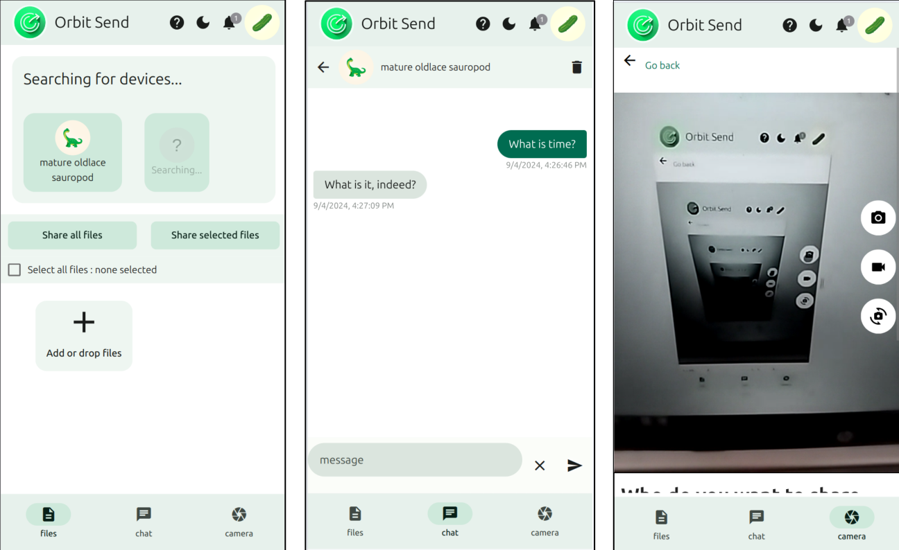

# orbit-send
#### Video Demo: https://youtu.be/tx7iE4pPQc8?si=FvQnkHFUbGFeYKHb
### Description:
A web application that allows sharing (of files/text/camera access) over a local network, through webrtc (with the [simple-peer.js library](https://github.com/feross/simple-peer/))

This project is being hosted with [cloudfare pages](https://pages.cloudflare.com/). You can try out orbit send at [orbit-send.pages.dev](http://orbit-send.pages.dev)
(The backend signalling server is hosted with [deno deploy](https://deno.com/deploy) at wss://fresh-hare-95.deno.dev)

its features include:
 * Automatic discovery of devices in the local network
 * Random assignment of a three word name from a possible 5.5×10⁵ names to each device that connects to a network
 * Transmission of files. (average speed: 1.57 Megabytes per second)
 * Text chat
 * Sharing of access to camera meaning that the remote device can view the camera input, take phographs and start or stop recording of video. This is good for situations where the camera needs to be far away from the photographer, for example for taking a group photo, selfie or a wildlife photo where the photographer can watch and operate a laptop or smartphone camera from a few meters away.
 * Secure encrypted transmission (I didn't implement this,[ but apparently it is already a feature of webrtc](https://webrtc-security.github.io/#4.3.))
 * Works cross platform. Tested on firefox an chrome on Linux, and Android os. Not tested on Safari on any Apple device because I do not have Apple devices.

## Local development

This requires nodejs and npm already being installed. The following steps work in a Linux system

clone this repository and enter directory

`git clone https://github.com/Irobot-2000/orbit-send.git && cd orbit-send`

install dependencies 

`npm i`

### frontend
The front end is a static website.The source code for the front end is mainly in the `src` directory. To run a development server,execute:

`npm run start`

to build the static website run:

`npm run build`

### backend
The backend is the signalling server written in typescript , to be executed by a deno interpreter. It consists of one file, mod.ts found in the folder backend-src

to locally run an instance of the signalling server:
`cd backend-src`
`deno run mod.ts`

you might want to edit the src/signal.js file,
comment out the first line

`const SIGNALLING_SERVER = "wss://fresh-hare-95.deno.dev"`

and uncomment the second

`//const SIGNALLING_SERVER = "ws://0.0.0.0:8000/"`

to set the front end to connect to the local instance of the server

## How it works
The discovery mechanism works by identifying devices in the same network. This identification is done by the backend signalling server. Devices with the same public ipv4 address, or a public ipv6 address starting with the same 64 bytes are assumed to be from the same network, although is seems that with ipv6 addresses there might be some inaccuracies, and devices not in the same local network might sometimes be visible, but I have no way to test this.

[Simple-peer.js](https://github.com/feross/simple-peer/) was used as a way to abstact away the complextity of the native webRTC api.

### File sharing
There is a limit to how much file data being received can be stored in RAM so each file is broken down into 'batches'. WebRTC has a limit to the ammount of data that can be sent at once, so a 'batch' is broken down into 'packets' 16KB in size.Each batch contains 1000 packets (approx 16MB), Each packet of a batch is sent as soon as the data for the packet is available. After a complete batch has been sent the sender requests an acknowledgement. The receiver sends responds by notifying the sender what packets of the 1000 packets are missing, or if there are no missing packets by sending the acknowledgement. The sender tries resending any missing packets and asks for an acknowledgement again. This continues as a loop until there are no missing packets. Then, at the receiver's side, the batch is written to secondary storage and space is made available in memory for the next batch. The remaining batches are then sent.

As mentioned earlier each batch is written to secondary storage just as it is received. This requires the window.showFilePicker function that is not yet implemented in firefox, safari, and all mobile browsers, so the [native-file-system-adapter(ponyfill) library](https://www.npmjs.com/package/native-file-system-adapter?activeTab=readme) was used.

### Chat
Just sending and receiveing text data through webRTC

### Camera sharing
The audio and video streams from the camera are streamed live through webRTC to one peer, and only one peer, when given access, while simultaneously being displayed an a video element
This other peer can control the taking of photos and videos by the original peer's device. The taking of photos and Videos are implemented in Orbit Send since I could not find a way to access the native camera application. 

## File structure of JS files in `src/js` directory
### app.js
This is the file that initializes the Framework7 instance, where [Framework7](https://framework7.io/) is the ui library that I used to make orbit send.

### orbit-send.js
This is the main part of the program, A large part of it handles file sharing. The fist part of the program code contains scripts common to all three of the main tasks of orbit-send.

The initializePeerEvents function is one of the most important functions in the code as it handles receiving of files, requests, text messages and media streams.

The final parts of the code have functions specific to each of the three main tasks seperately.

### helpers.js
This contains many helper functions that I wrote along with, more importantly, the FileManager, ChatMessageManager, and CameraManager classes that handle a large part of the three tasks.

### signal.js
This js file contains the scripts that enables a web socket connection between the signalling server and the browser. This connection only sends the Peer Ids, peer Names and webRTC  signalling data. No part of the files, media streams or text sent pass through this server.

#  credits

The logo and the name were designed by google's Gemini ai, Although I modified things a bit.

This program would not have been possible without the following libraries:

[simple-peer](https://github.com/feross/simple-peer/)

[native-file-system-adapter(ponyfill) library](https://www.npmjs.com/package/native-file-system-adapter?activeTab=readme)

[Framework7](https://framework7.io/)

[web-streams-polyfill](https://www.npmjs.com/package/web-streams-polyfill?activeTab=readme)